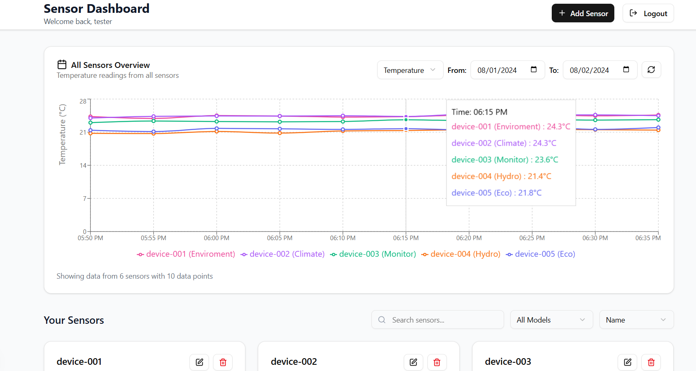
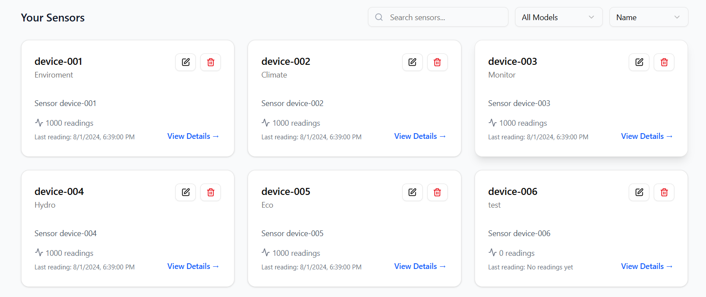

# Sensor Management System

A full-stack web application for managing sensors and their readings, built with Django Ninja (backend) and Next.js (frontend).

### Dashboard


## Tech Stack

### Backend
- **Python 3.13**
- **Django 5.1** - Web framework
- **Django Ninja** - Fast, type-safe REST API framework
- **PostgreSQL 15** - Database
- **JWT** - Authentication
- **Pytest** - Testing framework
- **Pydantic** - Data validation

### Frontend
- **Next.js 15** - React framework
- **TypeScript** - Type-safe JavaScript
- **Tailwind CSS** - Styling
- **shadcn/ui** - UI components

### DevOps
- **Docker** - Containerization
- **Docker Compose** - Multi-container orchestration


### Sensor List


### Sensor Details


## How to Run Locally

### Prerequisites
- Docker and Docker Compose

### Setup
```bash
git clone https://github.com/Emmyme/sensor-readings-app
cd sensor-readings-app

# Start everything
docker-compose up -d --build

# Run migrations
docker-compose exec backend python manage.py migrate
```

### Access
- **Frontend**: http://localhost:3000
- **Backend API**: http://localhost:8000
- **API Documentation**: http://localhost:8000/api/docs

### Getting Started
1. Register a new user at http://localhost:3000
2. Login with your credentials
3. Start creating sensors and adding readings!

## Run Tests

```bash
docker-compose exec backend python -m pytest
```

## API Overview

All endpoints require authentication (except auth endpoints). Base URL: `/api`

### Authentication
- `POST /api/auth/register/` - User registration
- `POST /api/auth/token/` - Login (get access token)
- `POST /api/auth/token/refresh/` - Refresh token

### Sensors
- `GET /api/sensors/` - List sensors (with pagination, search, filtering)
- `POST /api/sensors/` - Create sensor
- `GET /api/sensors/{id}/` - Get sensor details
- `PUT /api/sensors/{id}/` - Update sensor
- `DELETE /api/sensors/{id}/` - Delete sensor

### Readings
- `GET /api/sensors/{id}/readings/` - List readings for a sensor
- `POST /api/sensors/{id}/readings/` - Create reading

### Query Parameters
- **Sensors**: `page`, `page_size`, `search`, `model`, `sort_by`
- **Readings**: `page`, `page_size`, `timestamp_from`, `timestamp_to`
